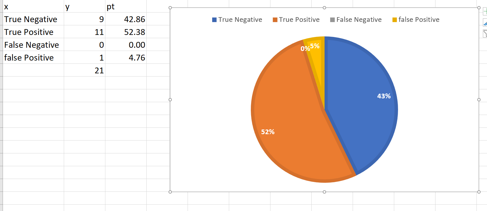

# Intelligent_Placer
Signal processing and interpretation
## Постановка задачи
Требуется создать “Intelligent Placer”: по поданной на вход фотографии нескольких предметов на светлой горизонтальной поверхности и многоугольнику понимать, можно ли расположить одновременно все эти предметы на плоскости так, чтобы они влезли в этот многоугольник. Предметы и горизонтальная поверхность, которые могут оказаться на фотографии, заранее известны.
Intelligent Placer” оформлен в виде python-библиотеки intelligent_placer_lib, которая поставляется каталогом intelligent_placer_lib с файлом intelligent_placer.py, содержащим функцию - точку входа
def checkImage(strPathToImg):
которая возвращает True если предметы могут влезть в многоугольник, иначе False.

### Требование 
#### **К входным данным**

#### Требования к фотографии
1. Тип Фото : .png или .jpg.
2. Фон фото : светлую горизонтальную поверхность.
3. Высота съемки: от 10 до 30 см
4. Угол наклона камеры: до 5 градусов
#### Требования к многоугольнику
1. Многоугольник должен быть задан замкнутым ломаным контуром, нарисованным темным маркером на белом листе бумаги, сфотографированной вместе с предметами.
2. Число вершин многоугольника : не больше 10.
3. Количество ребер многоугольника должно быть явно различимо

#### Требования к предмету
1. Границы всех предметов должны четко выделяться на фоне белого листа бумаги.
2. Предмет всегда на левая многоугольнику
3. Предметы не должны перекрывать друг друга
5. Нельзя повернуть предмет на каколй-либо угол, но можно поступательно двигать его.
8. Высота предмета не должны быть больше 3 см.
9. Один предмет может присутствовать на фото лишь 1 раз.
10. Предметы могут иметь разные ориентации/направление.
___
#### **К выходу**

- На основании результатов, записанных на имя и результатов, полученных машиной, мы определяем, является ли точность машины через ответ : один из двух ответов - "True"/"False", записанный в желаемый поток вывода (файл или консоль).
___

### Сбор данных
Файл Object и Input
### План решения
1. Найти граница 
   1. Преобразование изображения в оттенки серого с помощью cv2.cvtColor() 
   2. Размытие изображения с помощью cv2.GaussianBlur()
   3. Найдите ребра с помощью cv2.Canny()
   4. Используем метод fillhole чтобы идентифицировать объекты и формы с полным цветом (только другие цветные объекты и формы игнорируются (Функции fillhole - сам написал )
2. Четко определите объект и фигуру и сравните, есть ли объект на картинке.
	1. Мы получим фигур, полученных после залики по методе fillhole 
	2. Найти минимальный прямоугольник все фигуры после залики
	3. Мы убираем края по удаляя фигуры с площадью меньше 5 получаем размер объекта и форму (в правильном порядке: последнее изображение)
	4. Сейчас у нас только размерность обекты и фигры но фигра всегда на последний права поэтому 
	5. Сначала мы проверяем сумма площада все обекта больше ли фигра , если нет то false . Если да то продолжим 
	6. найти максимум размерность по все размерность 
	7. Если размерность максимума - не это фигур то False 
	                             - Если это фигур то мы проверяем сущестьвует 1 из двух размерность фигра больше сумма все обьекта . Если нет то false .Если да то True 
	8. Мы сравним результат получить из алгоритмы и результат из имя и дать результаты , которые алгоритм выполняет правильно или неправильно 
	                             
 ## **Результаты**

### **[Показательные случаи](./Demonstration.ipynb)**

### **Тесты**

#### [Демонстрация результатов](./Result test/result.txt)

#### Матрица ошибок

